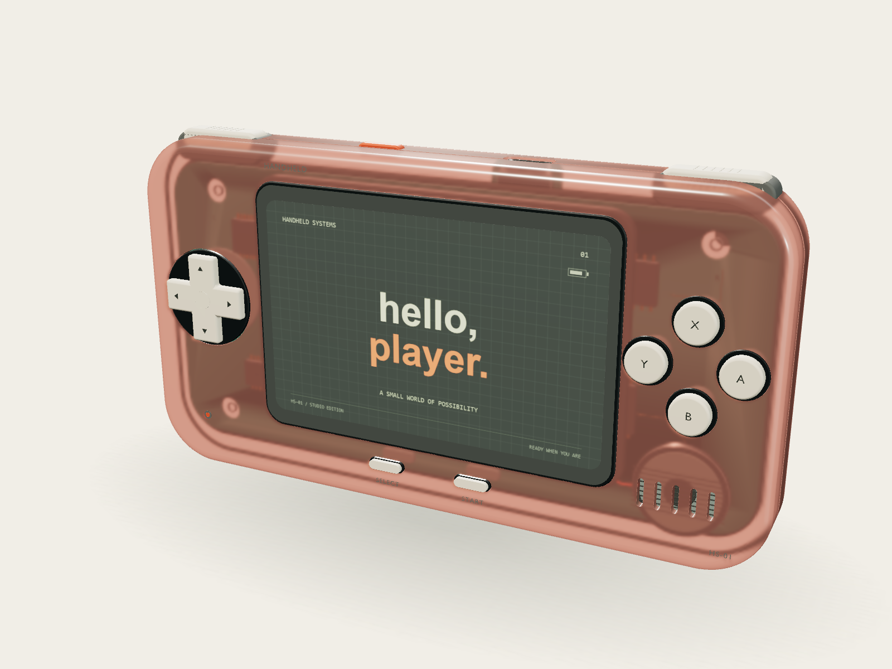
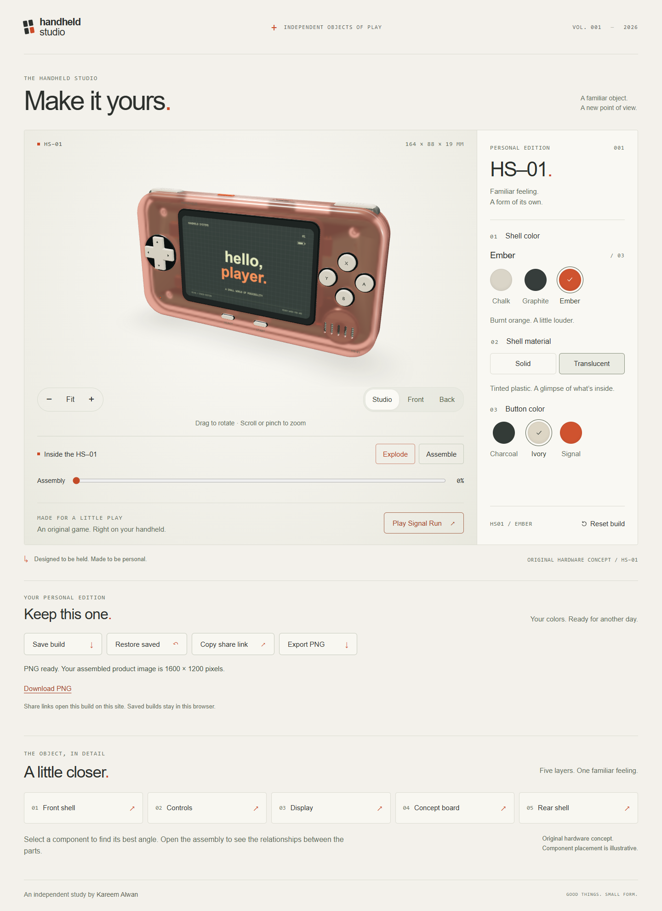
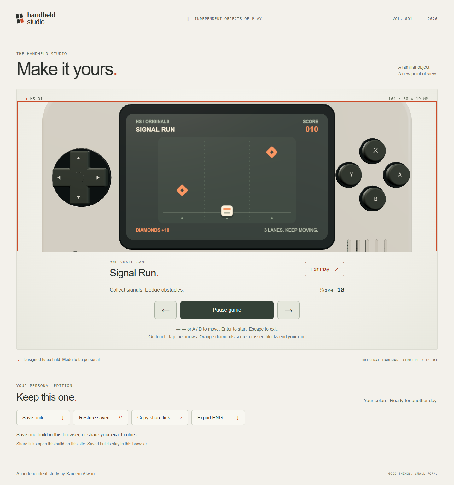

# Handheld Studio

An original 3D handheld configurator by [Kareem Alwan](https://github.com/KareemAl1), built with React, TypeScript, Vite and React Three Fiber. HS–01 brings tactile product design, inspectable hardware and a small playable game to a warm industrial-design workbench.

**[Open the live studio](https://handheld-studio.vercel.app)** · [GitHub repository](https://github.com/KareemAl1/handheld-studio)



## Features

- **Inspect the object:** drag rotation, smooth wheel/trackpad and pinch zoom, bounded framing, camera presets, Fit and Reset.
- **Make it yours:** three shell colors, three independent button colors, and solid or tinted translucent plastic — 18 combinations.
- **Look inside:** animated assembly slider, five aligned component layers and selectable detail views. Internal components are an original illustrative concept.
- **Play Signal Run:** an original collect-and-dodge game on the actual screen material, with score, game over, restart, keyboard and touch controls. Play assembles the device and locks the camera; Exit returns to inspection.
- **Keep and share:** explicit local save/restore, validated versioned URL configuration and a selectable link if clipboard access fails.
- **Export a product image:** opaque 1600 × 1200 PNG with clean assembled framing, the idle display and an ivory background. Export preserves the live camera, assembly and game.
- **Handle real conditions:** reduced motion, keyboard focus, enlarged-text reflow, loading/retry states, WebGL fallback and context recovery.

## Screenshots

| Studio | Signal Run |
| --- | --- |
|  |  |

[Live mobile configurator](docs/screenshots/live/site-mobile.png) · [Live mobile game](docs/screenshots/live/game-mobile.png) · [Exploded assembly](docs/screenshots/milestone-2/exploded-desktop.png)

These are actual browser captures and app-generated exports, not concept mockups.

## Run locally

Use **Node 22.12 or newer within the 22.x line**, npm and a WebGL2-capable browser. No API keys, environment variables, backend or account are needed to run the app. The committed lockfile pins the dependency tree.

```sh
npm ci
npm run dev
```

Open [localhost:5173](http://127.0.0.1:5173/). Keep the development terminal running.

For a preview that survives closing that terminal, use `npm run preview:start`. `npm run preview:status` checks the server and real model/poster URLs; `npm run preview:stop` stops only the process recorded by the launcher. Logs, process state and caches stay in ignored project directories. Run the launcher again after a reboot.

For a local production preview:

```sh
npm run build
npm run preview
```

The build checks dependency notices, typechecks the app and outputs static files to `dist/`. Vercel's build settings are committed in [vercel.json](vercel.json): Vite, `npm ci`, `npm run build`, output `dist`. Node 22.x is pinned in `package.json` and the Vercel project settings. Only `/` and query-string configurations are used, so no catch-all rewrite is needed. The Vercel project is connected to this repository; pushes to `main` deploy production. See [deployment and live verification](docs/deployment.md).

## Controls and saved builds

| Action | Input |
| --- | --- |
| Rotate / inspect | Pointer or one-finger drag; Front, Back and Studio buttons |
| Zoom | Wheel, trackpad pinch, two-finger pinch or Zoom buttons; Fit restores framing |
| Assembly | Explode / Assemble or the keyboard-accessible slider |
| Game movement | Left/Right, A/D or the touch arrow buttons |
| Start / restart | Enter with the viewer focused, or the game action button |
| Pause / resume | Space with the viewer focused, or the game action button |
| Exit Play | Escape or Exit Play |

A hidden tab pauses gameplay; returning requires Resume. Reduced motion removes decorative lane scrolling and skips camera/material/assembly tweening.

Save keeps **one configuration per browser origin**. A valid shared URL takes precedence over a saved build without overwriting it. Save or Restore clears an older shared query so the next reload honors that explicit action. Camera, assembly and game progress are not saved. Invalid URL/storage data falls back with feedback. Localhost share links only work locally; the live studio generates public links on `handheld-studio.vercel.app`. Saves made locally do not automatically transfer to the live origin.

## Engineering decisions

- **Configuration is independent of rendering.** A pure reducer validates and serializes schema-v2 shell, finish and button choices. The same boundary protects localStorage and URLs; native HTML controls retain browser keyboard/accessibility behavior.
- **Editable geometry stays editable.** Blender exports five named assembly groups. Runtime batching combines compatible static meshes within each group, reducing assembled draw calls from 92 to 26 while retaining independent layer movement and material ownership.
- **Motion has a clear owner.** Camera fitting projects conservative bounds into the view; assembly uses absolute offsets from immutable origins. Repeated or interrupted transitions cannot accumulate positional drift.
- **Rendering stops at rest.** Demand rendering and cached studio lighting avoid idle frame loops. The deterministic game uses a fixed-step external store and its own canvas texture; React subscribes only to HUD changes.
- **Export is isolated.** An assembled scene clone uses bounded offscreen targets and explicit color conversion. Renderer state is restored before PNG encoding, and export-owned GPU resources are disposed.

[Engineering notes](docs/engineering.md) explain the tradeoffs, failure paths and interview talking points. [Design direction](docs/design.md) records the visual decisions.

## Editable asset workflow

The browser needs only the committed GLB. **Blender is optional for web development.** Blender 5.2.1 was used to author and verify the asset; Python 3 runs the wrapper. Set `BLENDER_BIN` if Blender is not discoverable.

```sh
npm run asset:build
npm run asset:export
```

`asset:build` regenerates `assets/source/hs-01.blend` from the original procedural authoring script and replaces manual edits. To preserve edits made in Blender, run **only `asset:export`**. It exports `public/models/hs-01.glb` with named geometry and materials. Optional poster render: `python scripts/run_blender.py export --poster`.

The editable source (817 KB), authoring/export scripts and runtime model (1.80 MB) stay in Git. Authoring sources and documentation are not served in the website build. No Blender installation is needed on Vercel.

## Verification and limits

```sh
npm run lint
npm test
npm run test:e2e
npm run build
npm run test:production
npm run test:performance:game
```

Browser tests use **installed Google Chrome** via Playwright. They start/reuse the local Vite server. The production check creates its own temporary preview on port 4173 and closes it afterward; all browser profiles/downloads stay inside this project. Run performance measurement separately from other browser work. In environments that restrict the default Vitest config bundler, use `npm test -- --configLoader runner`.

To repeat the public HTTPS smoke test in PowerShell:

```powershell
$env:HS_LIVE_URL = 'https://handheld-studio.vercel.app'
npm run test:live
```

On macOS/Linux: `HS_LIVE_URL=https://handheld-studio.vercel.app npm run test:live`. This test opens fresh isolated Chrome profiles, uses test-only browser saves, grants clipboard permissions within those profiles, and writes evidence to `docs/screenshots/live/`.

The milestone-3 verification record contains **162 passing unit tests**, a full browser run of **79 passes / 5 intentional skips**, and a final focused run of **20 passes / 2 intentional skips**. The runs overlap: together they cover **82 distinct passing cases**, with six context/matrix skips. Production checks exercised actual screen pixels, the complete game loop, saved reload, URL round-trips and decoded PNG downloads. See [the exact results and captures](docs/milestone-3.md) and [the latest publication checks](docs/publication.md).

The **2026-09-14 live HTTPS check passed on desktop and Pixel 7 emulation** in Chrome 152: actual 3D shell changes, the complete game loop, keyboard/touch input, save/reload/restore, native clipboard sharing, invalid URLs and downloaded PNGs. Both contexts recorded zero page/console/network/HTTP errors. Saved and shared model pixels matched their configured reference; exports were opaque 1600 × 1200 PNGs. [Live results and limitations](docs/deployment.md) include the reproducible script and screenshots.

Measured game texture updates were 56 in 2.0028 seconds on desktop and 55 in 2.0030 seconds in mobile emulation. Paused/exited samples produced no extra viewer frames. This measures render callbacks/texture updates, **not GPU time or a guaranteed display frame rate**.

Known limits:

- Mobile tests use Pixel 7 viewport/touch emulation in Chrome, not a physical phone or Safari.
- Automated Chrome did not expose native background visibility on this host. Tests simulate the visibility boundary and exercise the real pause listener; native hiding still needs a target-browser manual check.
- The local regression suite instruments clipboard success and tests denied access separately. Live HTTPS checks verified the native clipboard with explicitly granted Chrome permissions; browser permission prompts and policies may differ.
- PNG export needs WebGL2 and float color-buffer support. It uses a fixed assembled studio view and idle boot screen, including during Play.
- The largest JS chunk is Three.js at about 710 kB minified / 183 kB gzip. The build warning remains visible; there is no physical-phone performance claim.

## Credits and licensing

HS–01 geometry, product identity, interface, procedural textures and Signal Run are original. Reference portfolios informed the workflow and visual study; no portfolio source code, model, prompt or media was copied:

- [Wang Ruofeng — Orbital Core Showcase](https://github.com/wangruofeng/orbital-core-showcase): editable Blender asset and reproducible browser export.
- [Bruno Simon — Folio 2025](https://github.com/brunosimon/folio-2025): asset optimization and separation of rendering, input and scene systems.
- [TripoGrowthLab — Awesome Astra Prompts](https://github.com/TripoGrowthLab/awesome-astra-prompts): descriptions of scroll-driven studio and refractive product work, credited there to ui.debbie and Himanshu Hingorani.

[Reference review and provenance](docs/references.md) records inspected sources, licenses, exclusions and viewing limitations. Interface text uses system fonts; Blender's bundled lettering is converted to geometry. No external font files, HDRIs or product textures were downloaded.

Runtime dependencies include React, Three.js, React Three Fiber and Drei. Applicable dependency notices ship in [public/third-party-notices.txt](public/third-party-notices.txt), generated with `npm run notices:generate` and checked during build. This dependency notice does not license the original project. **No project-wide license has been selected yet.**
